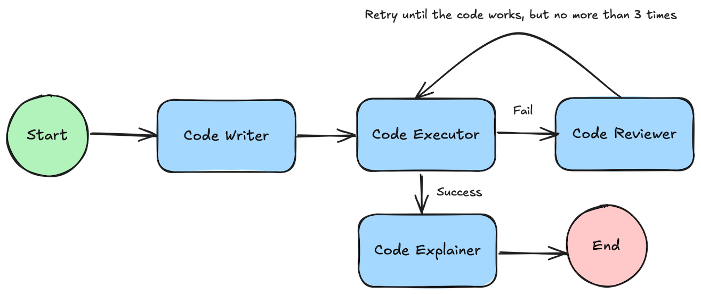

# DataMancer: Multi-Agent Data Analysis

Large language models, like GPT, have made remarkable strides in handling tabular data and performing analysis tasks. Despite their impressive capabilities, these models still face challenges, such as hallucinations and limitations in processing truly massive datasets. However, by using a multi-agent approach, you can harness AI’s power even for large-scale data analysis. In this post, I’ll introduce you to the concept of multi-agent systems through a toy project I recently built. Let’s explore together how multiple AI agents can work together to overcome these challenges and unlock new possibilities in data analysis.


To make you excited let me show what the result system is capable of. Here is a youtube video:

<a href="https://www.youtube.com/watch?v=tSfRsjB79YA">

</a>


## What are multi-agent system?

A multi-agent system (MAS) consists of several autonomous agents that work together to achieve common goals. Each agent operates independently but can communicate and collaborate to solve more complex tasks.  MAS can be particularly advantageous for complex problems, where distributing tasks among multiple specialized agents with access to specific tools leads to robust and reliable solutions.

## How to build a MAS system?
Multi-Agent Systems (MAS) are among today’s hottest topics, supported by frameworks like OpenAI Swarm and LangGraph. The core component of these systems is an LLM capable of reasoning and tool-calling, which often requires a more advanced model. For instance, according to LLama documentation, the smallest model meeting these criteria is 8B, though a 70B model is recommended for greater reliability. However, tool-calling is not always essential if workflow paths are carefully designed with respect to specific use case.

In this project, I used LangGraph and OpenAI to expedite development and leverage existing LLM APIs rather than setting up my own infrastructure. Exploring and evaluating different models could also be an interesting exercise for assessing performance. Moreover for the user interface part, I rely on ChainLit.

## Meet my agents
Data scientists work with data to uncover meaningful insights, leveraging a range of skills: code writing and review, code execution, and the ability to present their reasoning in simple language. Each of these skills is represented by a distinct agent, collectively forming the “data scientist.

### Code writer
Data scientist often rely on a toolset based on the Python programming language, along with libraries such as Pandas, SciPy, NumPy, and Plotly. This toolset enables them to write Python code that processes data and calculates relevant statistics.

### Code executor
Once the data scientist completes the implementation, the code must be executed. For this, I have a separate agent whose sole role is to run the code, without needing to understand its purpose. However, even the best data scientists sometimes write code that fails to run.

### Code reviewer
Following this, a code reviewer steps in. They receive both the code and error description, then work to rewrite the code so it functions correctly. The revised code is sent back to the code executor. If it fails again, the reviewer iterates on the corrections, repeating this up to three times to avoid infinite loops. If the code remains non-functional, it may indicate a fundamental issue with the data scientist’s initial reasoning.

This iterative correction pattern is known as Reflection and is widely used in designing data agent systems, often with variations across implementations.

### Code explainer
The code serves as a detailed record of the data scientist’s reasoning. However, system users are unlikely to understand the code itself. Therefore, another agent is responsible for explaining the reasoning in non-technical language, avoiding direct references to the code or technical jargon. For instance, a code line like sorted(elements, reverse=True) would be translated to “The list of elements is sorted in descending order.”

The overall workflow of the agents making a data scientist could be explained by the following graph:




## Defining an agent
To streamline implementation, I created a BaseAgent class. Now, to create a new agent, you simply inherit from this class and store the agent system prompts in the prompts directory.
```python
class GraphNode(ABC):
    def __init__(self, name):
        self.name = name

    @abstractmethod
    async def arun(self, state: GraphState) -> Dict[str, Any]:
        pass
    
class BaseAgent(GraphNode):
    def __init__(self, prompt_file_name: str, llm: Any, output_structure: Any = None, name=None) -> None:
        super().__init__(name if name else prompt_file_name)
        self.llm = llm
        prompt_file_path = os.path.join("prompts", f"{prompt_file_name}.txt")

        try:
            with open(prompt_file_path, "r") as file:
                prompt_content = file.read()
            prompt_template = ChatPromptTemplate.from_template(prompt_content)
            if output_structure:
                self.chain = prompt_template | self.llm.with_structured_output(output_structure)
            else:
                self.chain = prompt_template | llm | StrOutputParser()
        except FileNotFoundError:
            raise ValueError(f"Prompt file '{prompt_file_path}' not found.")

    async def ainvoke(self, **kwargs: Any) -> Any:
        return await self.chain.ainvoke(kwargs)
```
For instance, a simple agent, which we’ll call MrSmith, could be represented by the following class:
```python
class MrSmith(BaseAgent):
    def __init__(self, prompt_file_name: str, llm: Any, name) -> None:
        super().__init__(prompt_file_name, llm)

    async def arun(self, state: GraphState) -> Dict[str, Any]:
        return await self.ainvoke(input=state["task"])
```
And the proper prompt inside the prompts directory

```
prompts
-- AgentSmith.txt
```

Ale the actual agents implementations might be found inside the agents.py file with the repository.

## Getting the agents to collaborate
Once the agents are defined, we can use LangGraph to specify their interactions, effectively creating a graph. It’s worth noting that my system includes two distinct code-writing agents: one dedicated to data analysis using Pandas, and another focused on data visualization with Plotly. Additionally, the data scientists can be configured with other specialized code-writing agents that utilize specific libraries as needed.

```python
class DataScientist(GraphNode):
    def __init__(self, llm, code_writer, df):
        super().__init__(f"{self.__class__.__name__}_{code_writer.name}")
        self.code_writer = code_writer
        self.code_executor = CodeExecutor(df)
        self.code_reviewer = CodeReviewer(llm)
        self.code_explainer = CodeExplainer(llm)

        graph_builder = StateGraph(GraphState)
        graph_builder.add_node(self.code_writer.name, self.code_writer.arun)
        graph_builder.add_node(self.code_executor.name, self.code_executor.arun)
        graph_builder.add_node(self.code_reviewer.name, self.code_reviewer.arun)
        graph_builder.add_node(self.code_explainer.name, self.code_explainer.arun)

        graph_builder.add_edge(START, self.code_writer.name)
        graph_builder.add_edge(self.code_writer.name, self.code_executor.name)
        graph_builder.add_conditional_edges(
            self.code_executor.name,
            self.is_working,
            {True: self.code_explainer.name, False: self.code_reviewer.name}
        )

        graph_builder.add_edge(self.code_reviewer.name, self.code_executor.name)
        graph_builder.add_edge(self.code_explainer.name, END)

        self.graph = graph_builder.compile()

    def is_working(self, state: GraphState) -> bool:
        return state["execution_error"] is None or state["no_of_retries"] <= 0

    async def arun(self, state: GraphState) -> Any:
        return await self.graph.ainvoke(state)
```
An essential aspect at this stage is the state of the graph—essentially how LangGraph maintains and manages information shared among the different agents. Let’s take a closer look at it:

```python
class Task(Enum):
    PLOTING = "plotting"
    ANALYZING = "analyzing"
    GENERAL = "general"


class GraphState(TypedDict):
    messages: Annotated[list, add_messages] # contains the message history
    current_task: str # the instruction to be executed
    current_code: str # the code generated by the code writer
    current_data_preview: str # the current data table stored as a markup
    no_of_retries: int # initialized to 3 each time new user message arrives
    execution_error: str # the execution error description, or empty
    result_data_frame: str # the answer produced by the data scientist
    result_chart: str # the answer produced by the data visualized
    dispatched_task: Task # the task to perfomed
```

## More agents
If you examine the GraphState closely, you’ll notice a field called dispatched_task. Additionally, the Task enum includes values not only for plotting and analyzing but also a value called General. What’s the purpose of these elements? It’s time to introduce you to more agents.

### Dispatcher
Since our agents team includes two specialized data scientist agents—one for plotting and the other for data analysis—there’s a need to distribute tasks between them. This is where the dispatcher comes into play.

### Genaralist
For questions requiring general knowledge beyond the available data, this agent is responsible for handling them. The dispatcher determines if general knowledge is needed and, if so, assigns the question to the generalist agent for an answer.

### Contextualizer (Conversation History Management)
Managing a chatbot’s message history can be challenging, but there’s an effective pattern to handle it: contextualizing the query using the available message history. In simple terms, the query is rephrased to include all necessary information, enabling it to be answered without directly accessing the full history. Here’s an example:

Conversation history:
```
(1) USER: What is the market share per product type?
(2) AI AGENT:
Men's Street Footwear has the largest market share at 23.21%, followed by Women's Apparel at 19.90%, 
Men's Athletic Footwear at 17.08%, Women's Street Footwear at 14.22%, Men's Apparel at 13.75%, and 
Women's Athletic Footwear at 11.85%.
```
New user query:
```
Based on the above result show me what is the market share for women and men's products acordingly?
```
User query rewritten by the contextualizer:
```
What is the market share for women and men's products based on the fact that men's Street Footwear has the largest
market share at 23.21%, followed by Women's Apparel at 19.90%, Men's Athletic Footwear at 17.08%, Women's Street 
Footwear at 14.22%, Men's Apparel at 13.75%, and Women's Athletic Footwear at 11.85%.
```

## Putting it all together
In conclusion, the architecture of the entire system is as follows


## Installation & Running
Obviously the first thing is to get the code:
```bash
git clone https://github.com/neuronow/data-mancer.git
```
And install the dependencies
```bash
pip install -r requirements
```
Then you can simply run the app. It will open the browser with the chatbot window.
```bash
chainlit run app.py
```

## Conclusions
The system presented here is a great starting point for experimenting with multi-agent systems in data analysis. However, it’s not yet mature enough to be considered a production-ready tool. Both the prompts and agents have limitations in their current capabilities. Still, this setup offers a promising glimpse into what could be possible with further development and as more advanced iterations of large language models emerge. 

Feel free to contribute to this project and make it the open-source tool of choice for data analysis!
